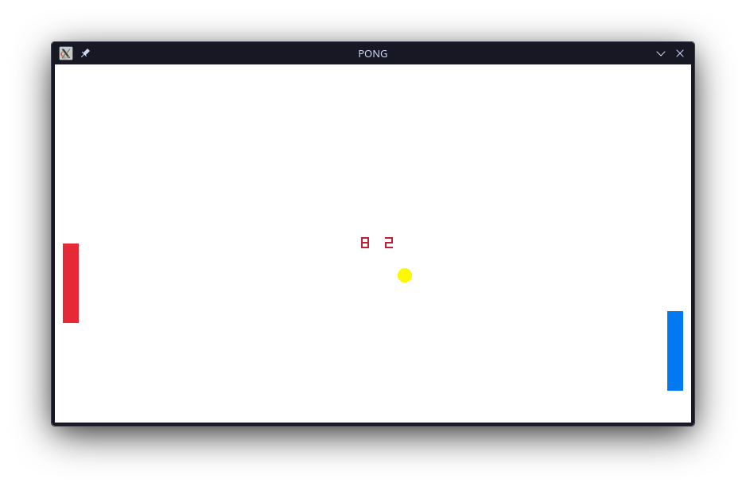

# Choco

The chocolate programming language!

## Demo

```python
# A box of chocolates is a class
box Cat {
    let name = "cat";
    let age = 10;
}

let chocolates = 10;
# A confection is a function
confection greet_user(my_cat, user) {
    print("Hello, there " + user + ". My name is " + my_cat.name + ", and I'm " + my_cat.age + " years old!");
    # A gift is a return statement
    gift chocolates;
}

let steve = new Cat();
steve.name = "Steve";
let anna = new Cat();
anna.name = "Anna";
anna.age = "5";

let user_name = input("Hello there. What's your name?   ");
greet_user(steve, user_name);
greet_user(anna, user_name);
```

> [!NOTE]
> Basic math, list, string functions are also implemented. Browse around tests/ or examples/game.choco to explore! Or look at the source code yourself and modify Interpreter::evaluate_function_call() yourself!

Check out an entire pong game located in the examples directory using Raylib as a graphics backend!


## Build

Ensure you have CMake installed. Then run the following:

```
./build.sh
```

The project is located in build/

```
./build/choco <file-name>
```

## Features

- Tokenization
- AST Parser
- Interpreter
- Strings and Lists
- Functions and Structs (No function pointers)
- While Loops, Conditional Statements, Expressions
  > [!IMPORTANT]
  > For loops, break, continue are not implemented!
- Basic Mathematical/Graphics/List/String Functions

> [!NOTE]
> No garbage collection so this significantly more memory than expected. Future implementations may include a garbage collector.

> [!NOTE]
> Objects & Lists are treated as references so passing through functions will modify the original argument

> [!NOTE]
> Variables have scoping. But you can modify a global variable anywhere so be careful.

Non-typed languages are _SLOW_ (i.e. Python). Everything has to be a pointer (we don't know the size of our object) causing cache misses. Compared to C where you simply index a spot in memory.

## Resources

- [Let's Build A Simple Interpreter](https://ruslanspivak.com/lsbasi-part1/)
- [Crafting Interpreters](https://craftinginterpreters.com/a-tree-walk-interpreter.html)
